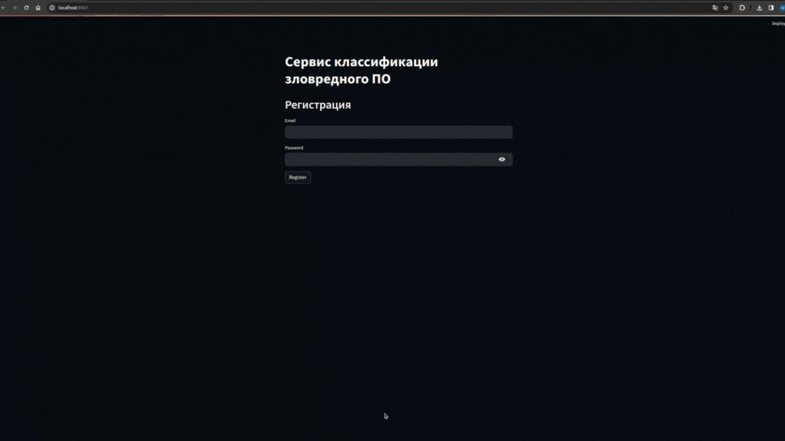

# Сервис классификации зловредного ПО

## ОПИСАНИЕ СЕРВИСА
Сервис предназначен для классификации зловредного и безвредного программного обеспечения на мобильных устройствах с системой Android.     
Классификация осуществляется с помощью моделей машинного обучения.



## ИНСТРУКЦИЯ ПО ЗАПУСКУ

**Для запуска приложения у вас должен быть установлен Docker.**

Чтобы воспользоватся сервисом выполните следующие команды:

1. Склонируйте репозиторий: 
   ```
   git clone https://github.com/Mikhail-Repkin/malware-classification-service.git
   ```
2. Зайдите в папку:
   ```
   cd malware_classification_service
   ```
3. Сборка образа:
   ```
   docker-compose build
   ```
4. Запустите контейнер в фоновом режиме:
   ```
   docker-compose up -d
   ```
5. После этого с приложением можно работать по адресу: [http://localhost:8501/](http://localhost:8501/)

6. Для тестирования приложения в корне проекта находится CSV-файл: [test_file.csv](https://github.com/Mikhail-Repkin/malware-classification-service/blob/main/test_file.csv).

7. Перед тем как загрузить собственные данные приведите структуру и формат данных в соответствие с тестовым файлом.

8. После того, как вы закончите работу, вы можете остановить приложение, удалить контейнер и образ.
    ```
    docker-compose down --rmi all
    ```

## СТРУКТУРА ПАПОК ПРОЕКТА

```shell
.github/
├── app                                           
│   ├── api routes                              # Эндпоинты API
│   │   └── ...                           
│   ├── core                                    # Основные модули приложения
│   │   ├── db.py
│   │   ├── model_inference.py
│   │   └── security.py
│   ├── ml_models                               # Модели машинного обучения (веса)
│   │   └── ...
│   ├── models                                  # Модели данных для различных сущностей
│   │   ├── all_models.py
│   │   └── base.py
│   ├── predictions_folder                      # Папка для сохранения результатов предсказаний
│   ├── repositories                            # Скрипты для работы с БД
│   │   ├── model_repo.py
│   │   ├── prediction_repo.py
│   │   └── user_repo.py
│   ├── schemas                                 # Схемы данных
│   │   ├── model.py
│   │   ├── prediction.py
│   │   ├── token.py
│   │   └── user.py
│   ├── services                                # Сервисный слой
│   │   ├── auth.py
│   │   ├── predictions.py
│   │   └── users.py
│   ├── tests                                   # Тесты
│   │   └── ...
│   ├── config.py                               # Конфигурационный файл
│   └── __main__.py                             # Файл для инициализации приложения      
├── notebooks                                   # Jupyter Notebooks
│   └── malware_classification.ipynb            # Ноутбук с обучение моделей
├── .env                                        # Переменные окружения
├── docker-compose.yaml                         # Docker Compose
├── Dockerfile                                  # Файл для создания Docker-образа
├── poetry.lock                                 # Lock-файл для Poetry
├── pyproject.toml                              # Файл конфигурации Poetry
├── README.md                                   # Документация проекта
├── requirements.txt                            # Файл зависимостей Python
├── start.sh                                    # Скрипт для запуска различный служб
├── streamlit_app.py                            # Фронтэнд на Streamlit
├── test_file.csv                               # Файл для демонстрации работы приложения
└── worker.py                                   # Инициализация RQ Worker
```

## TODO
* возможность пользователю пополнять баланс;
* выгрузка истории предиктов;
* возможность удаления аккаунта;
* проверка структуры файла;
* доступ к информации о транзакциях пользователя (списаний/зачислений кредитов);
* маска проверки email и password на форме регистрации/аутентификации.